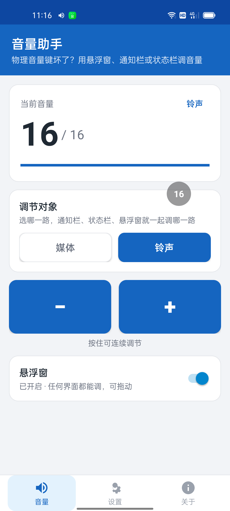
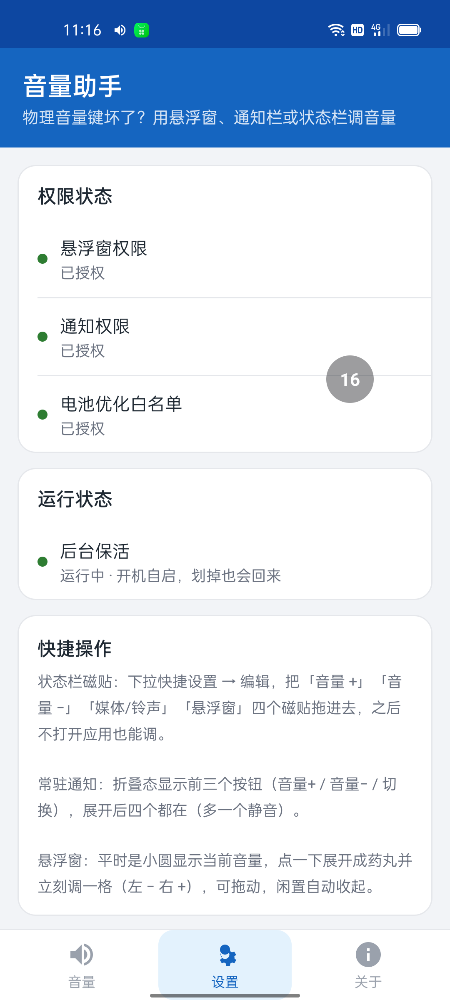
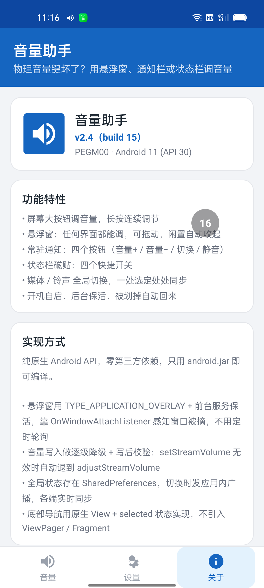

# VolumeTool 音量助手

仓库：<https://github.com/niavigg/Volume-Tool> · 许可证：[MIT](LICENSE)

给**物理音量键坏了 / 不方便按**的设备准备的音量控制工具。悬浮窗、常驻通知、状态栏磁贴、屏幕大按钮，四种方式随时调音量，全部实时同步。

## 下载

到 [Releases](https://github.com/niavigg/Volume-Tool/releases) 下载最新的 `VolumeTool-v1.0.apk`，装好后不用切回主界面，授权悬浮窗权限即自动生效。

界面风格参考开源项目 [SmsForwarder（短信转发器）](https://github.com/pppscn/SmsForwarder)，在此感谢。

| 音量 | 设置 | 关于 |
|---|---|---|
|  |  |  |

## 功能

- **悬浮窗**：任何界面都能调音量。平时是小圆显示当前音量，点一下展开成药丸（左 − 右 +），可拖动，闲置自动收起
- **常驻通知**：四个按钮（音量+ / 音量− / 切换 / 静音），折叠态显示前三个
- **状态栏磁贴**：音量+、音量−、媒体/铃声切换、悬浮窗开关，四个快捷磁贴
- **屏幕大按钮**：点一下调一格，长按连续调节
- **媒体 / 铃声全局切换**：一处选定，通知栏、状态栏、悬浮窗、首页处处同步
- **保活**：开机自启、前台服务、被划掉自动回来、电池优化白名单引导

## 兼容性说明

针对国产 ROM 做了不少适配，其中两个坑比较隐蔽，写在这里给同类应用参考：

1. **部分机型（OPPO / 一加 ColorOS 实测）会静默吞掉 `setStreamVolume()` 的写入**——调用不报错但音量不变。本应用采用「逐级降级 + 写后校验」：先 `setStreamVolume`，写完立刻读回来验证，没变就退到 `adjustStreamVolume`，再不行带 `FLAG_SHOW_UI` 重试。
2. **悬浮窗存活检测不要用「定时轮询 + `isAttachedToWindow()`」**——退出宿主界面后该值会短暂为 false，导致窗口被反复拆除重建，触摸事件全部丢失。正确姿势是 `ViewTreeObserver.OnWindowAttachListener` 只在真被摘掉时补回。

## 构建

零第三方依赖：不用 Gradle、不用 androidx，只需要 JDK 和 Android build-tools。

准备：

- JDK 11+（`javac` / `jar` / `java` 在 PATH 或环境变量指定）
- Android SDK build-tools 34.0.0（aapt2 / d8 / zipalign / apksigner）
- Android platform `android-34` 的 `android.jar`

一键构建：

```bash
export ANDROID_SDK=/path/to/android-sdk     # 含 build-tools/34.0.0 与 platforms/android-34
export JAVA_HOME=/path/to/jdk
./build.sh
```

产物在 `dist/VolumeTool-v<version>.apk`。签名密钥 `dist/volume.keystore` 是开发测试密钥（pass: volumetool123），发布前请换成你自己的。

## 项目结构

```
volume-tool/
├── project/
│   ├── AndroidManifest.xml
│   ├── src/com/xuhao/volumetool/   # 全部 Java 源码（14 个类）
│   │   ├── MainActivity.java        # 主界面：底部导航三页（音量/设置/关于）
│   │   ├── Streams.java             # 媒体/铃声全局状态（SharedPreferences + 广播同步）
│   │   ├── VolumeHelper.java        # 音量读写：降级链 + 写后校验
│   │   ├── VolumeNotifier.java      # 常驻通知（内容签名比对，避免无效 notify 被吞）
│   │   ├── VolumeReceiver.java      # 通知按钮的广播接收器
│   │   ├── OverlayService.java      # 悬浮窗服务（小圆/药丸两态）
│   │   ├── KeepAliveService.java    # 前台保活 + 轮询兜底刷通知
│   │   ├── BootReceiver.java        # 开机自启 / 应用被更新后自恢复
│   │   ├── KeepAliveReceiver.java   # 保活闹钟
│   │   ├── VolumeTileBase.java      # 音量磁贴基类
│   │   ├── VolumeUpTileService.java / VolumeDownTileService.java
│   │   ├── StreamTileService.java   # 媒体/铃声切换磁贴
│   │   └── OverlayTileService.java  # 悬浮窗开关磁贴
│   └── res/                         # 布局、矢量图标、配色
├── docs/screenshots/
├── dist/                            # 构建产物（不入库）
└── build.sh
```

## 使用提示

- 状态栏磁贴需要手动添加：下拉快捷设置 → 编辑 → 把四个磁贴拖进去
- 悬浮窗在部分 ROM（MIUI / ColorOS）上需要额外打开「后台弹出界面 / 后台显示悬浮窗」，这是系统限制，应用无法绕过
- 最低支持 Android 8.0（API 26），编译目标 API 34

## License

[MIT](LICENSE)

## 鸣谢

**先把话说在前面：以下不是广告，不是广告，不是广告。** 只是如实记录这个项目是靠什么做出来的，不推荐、不背书、没收任何好处。

- **阿里云百炼平台**：提供了 20 多个可免费使用的 AI API（新号有免费试用额度）。本项目前期的代码生成、兼容性问题排查大量跑在这上面。
- **WorkBuddy**：在项目收尾阶段提供了支持 —— 说白了就是借了几个免费模型来用用，帮忙做界面重做、Bug 定位、源码与开源文件整理这些收尾的活。
